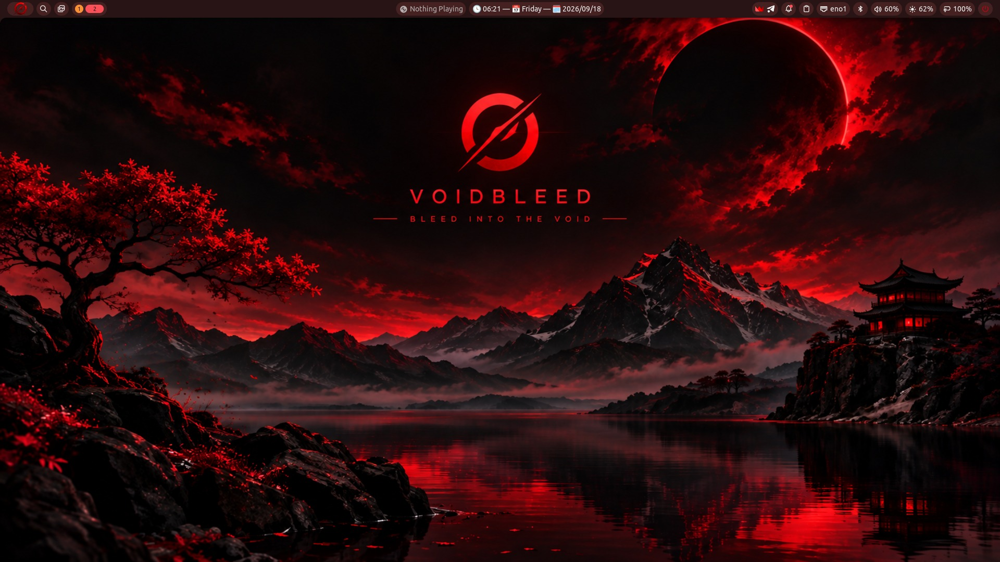
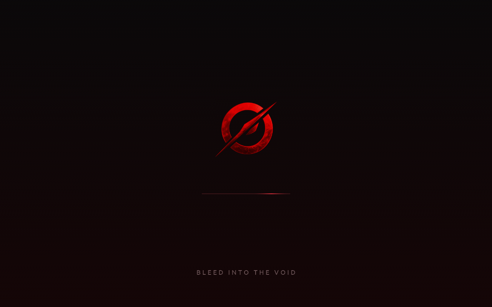
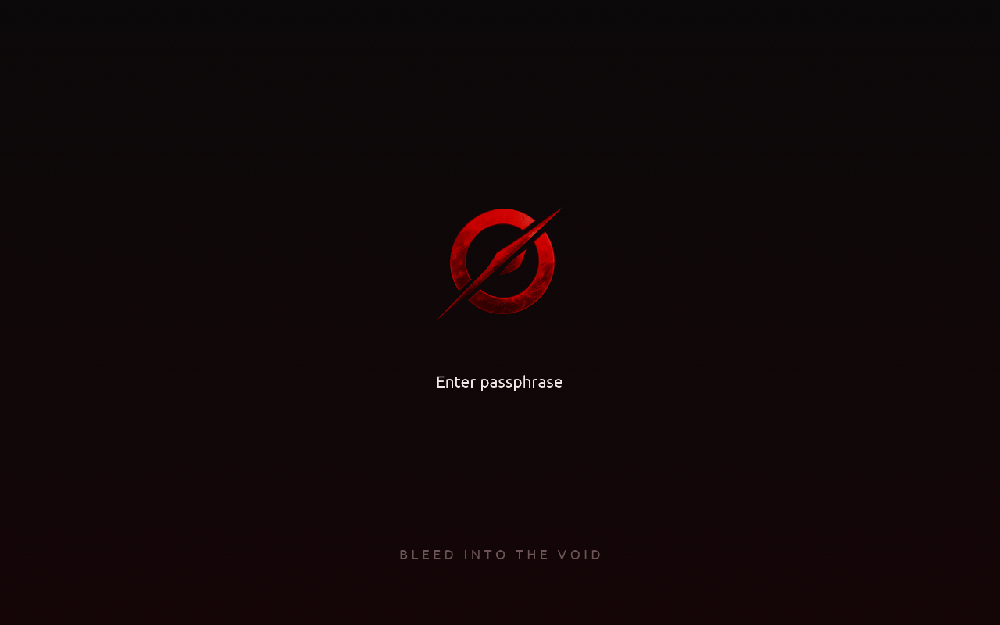

<div align="center">


# VOIDBLEED

**Bleed into the void.**

A Void Linux variant for laptops and desktops — Wayland, niri and Noctalia,
red on black, installed by a TUI that fits on an 80×24 console.




</div>

## What this is

Voidbleed is one machine's setup turned into a distribution. Every package,
service and dotfile is declared in [`catalog/`](catalog/), built into signed
`voidbleed-*` packages, baked into a live ISO, and put back on disk by an
installer that walks eleven screens and then gets out of the way.

Nothing is hidden behind a configuration framework: the desktop is a
`/etc/skel` you can read, the packages are xbps-src templates, and the
installer is a Go program whose dry run prints every command it would execute.

## The desktop

| | |
|---|---|
| **Compositor** | niri — scrollable tiling on Wayland |
| **Shell** | Noctalia v5 — bar, launcher, control centre, notifications |
| **Login** | greetd + noctalia-greeter, themed from the session it just left |
| **Terminal** | Ghostty |
| **Files** | Thunar, with Ghostty wired in as its terminal |
| **Look** | adw-gtk3-dark · Reversal-red icons · Vanilla-DMZ cursor · Ubuntu 10 |
| **Audio** | PipeWire + WirePlumber, with ALSA and JACK bridges |
| **Keyring** | gnome-keyring, unlocked at login, SSH agent included |
| **Shell (text)** | fish, with starship, `~/.local/bin` on `PATH` and vpm completions |
| **Apps** | mpv · gThumb · Papers · Lollypop · btop · Mousepad · Flatpak (opt-in) |

The catalog currently resolves to **19 base**, **27 desktop** and **32 default**
packages, plus **18 optional groups** — about 650 packages on a finished
install.

## Boot splash

<div align="center">


</div>

A Plymouth theme drawn by the script plugin: the logo over a red sweep, and the
passphrase prompt for an encrypted root. The initramfs carries no fonts, no
fontconfig and no label plugin, so every word on that screen is a picture —
rendered at build time by [`scripts/gen-splash-assets.py`](scripts/gen-splash-assets.py).
It hands the display to the greeter with `--retain-splash`, so the logo stays
put until the login screen paints over it.

## The installer

A Bubble Tea TUI that also runs unattended. UEFI only, GPT, and it will not
touch a disk until you type its name by hand.

- **Filesystems** — ext4, or btrfs with `@`, `@home`, `@snapshots`, `@var_log` subvolumes (plus `@swap`, uncompressed, when a swapfile is asked for)
- **Encryption** — LUKS2 on the root, with the ESP left readable for GRUB
- **Swap** — zram, a swapfile (btrfs-aware), a partition, or none
- **Source** — copy the live system (offline, ~2 minutes) or install current packages from the mirrors
- **Hardware** — detects NVIDIA by architecture (Turing+ vs the 580 branch), Intel and AMD graphics, microcode, laptops, Bluetooth, and preselects the right groups
- **Software** — optional groups from the catalog, Flatpak apps included, with "needs internet" marked where the live image can't help
- **Review** — `ctrl+d` prints every command the install will run, produced by the dry-run engine itself

```sh
voidbleed-installer --demo     # the whole flow against fake hardware, no root, nothing touched
voidbleed-installer --config install.toml --yes
```

```toml
[system]
hostname = "void"
timezone = "Asia/Tehran"
locale = "en_US.UTF-8"
keyboard_layouts = ["us", "ir"]

[disk]
device = "/dev/nvme0n1"
filesystem = "btrfs"
encrypt = true
passphrase = "…"

[swap]
mode = "file"
size_mib = 8192

[user]
name = "reza"
password = "…"

[install]
source = "network"
groups = ["gpu-nvidia", "flatpak", "firefox"]
```

## The control centre

[`voidbleed-control`](https://github.com/Borderliner/voidbleed-control) is the
other half: one interface for what a Void machine otherwise needs a page of
remembered commands for. Same palette, same glyphs, same card as the installer.
It lives in its own repository, because it works on any Void system:

```sh
sudo xbps-install -S --repository=https://void.7mm.ir/current voidbleed-control
```

| Section | What it does |
|---|---|
| **Packages** | installed, waiting updates and repository search in one list, with xbps's own description in a side pane; install, remove, update, sync, clean the cache and orphans |
| **Flatpak** | applications and runtimes, updates, search and install from Flathub, prune what nothing uses |
| **Services** | every runit service, enabled or not, with live state; enable, disable, start, stop, restart |
| **Firmware** | fwupd devices and the updates waiting for them, with the version spelled out before anything is written |
| **Appearance** | GTK, Qt, icons, cursor and fonts set together — written to gsettings *and* the toolkit files, because the portal reads one and everything else reads the other |
| **Firewall** | ufw: on or off, default policy, and the rule list |

Reading is unprivileged. Anything that changes the machine names itself, asks
for the sudo password once, and streams its output where you can watch it;
removals and firmware ask before they start.

```sh
voidbleed-control          # manage this machine
voidbleed-control --demo   # the whole interface against canned data, changing nothing
```

Voidbleed installs it as part of the desktop, and points at
[void.7mm.ir](https://void.7mm.ir) so it updates with everything else.

## Build it

Needs a Void machine with `xbps-src` dependencies, `qemu-system-amd64` and
`edk2-ovmf` for testing, and an RSA key to sign the repository
(`packages/config.env` says where it lives).

```sh
scripts/build-packages.sh              # build every voidbleed-* package into build/repo, signed
sudo scripts/build-iso.sh --fast       # live ISO into build/ (lz4; drop --fast for a smaller xz image)
scripts/qemu-test.sh                   # boot the newest ISO, UEFI + KVM + virgl, in a window
```

## Test it

```sh
scripts/catalog.py validate            # catalog, templates and repositories agree
go test ./...                          # engine golden transcripts, TUI walkthroughs, hardware rules
scripts/test-repo.sh                   # install the packages in a scratch root and check the result
scripts/vm-install-test.py --config install.toml     # a real install in QEMU, then boot the disk
scripts/vm-install-test.py --live-script scripts/live-splash-check.sh --shot-every 6   # render the splash in a live VM
```

`test-repo.sh` is the fast gate: it serves the signed repo over localhost,
resolves a complete install, then installs the config packages into a user
namespace and checks what actually landed — branding, kernel pinning, the
greeter, the theme, the splash, and that nothing collides with the NVIDIA
drivers.

## How it is put together

The catalog is the source of truth. Package lists become metapackage
dependencies (`scripts/catalog.py sync-templates`), overlays become the files
those packages ship, and the installer reads the same catalog at runtime — so
the ISO, the installed system and the tests cannot drift apart.

| Path | What it is |
|---|---|
| `catalog/base.txt`, `catalog/desktop.txt` | Hard dependencies of `voidbleed-base` / `voidbleed-desktop` |
| `catalog/defaults.txt` | Installed everywhere but removable (Thunar, btop, mpv, …) |
| `catalog/optional.toml` | Groups chosen in the installer, with hardware detection rules |
| `catalog/services.txt` | runit services enabled on every install |
| `catalog/excluded*.txt` | What was left out of the reference machine, and why |
| `overlays/system/` | Shipped by `voidbleed-config`: branding, xbps rules, sudoers, splash theme |
| `overlays/desktop/` | Shipped by `voidbleed-desktop-config`: skel, greetd, portals, PipeWire |
| `overlays/nvidia/` | Shipped by `voidbleed-nvidia-config` |
| `packages/srcpkgs/` | xbps-src templates for the `voidbleed-*` packages |
| `packages/fallback/` | Unbuilt templates, in case the voiders repo disappears |
| `iso/` | Live ISO: package groups, live-only files, postsetup hook |
| `cmd/`, `internal/` | The installer: engine, hardware detection, catalog, TUI and the theme it shares with the control centre |
| `scripts/` | Catalog checks, package and ISO builds, repo tests, QEMU harnesses |
| `docs/` | Branding and per-phase notes |

## Built on

[Void Linux](https://voidlinux.org) · [niri](https://github.com/YaLTeR/niri) ·
[Noctalia](https://github.com/noctalia-dev/noctalia-shell) ·
[Ghostty](https://ghostty.org) · [greetd](https://sr.ht/~kennylevinsen/greetd/) ·
[adw-gtk3](https://github.com/lassekongo83/adw-gtk3) ·
[Reversal icons](https://github.com/yeyushengfan258/Reversal-icon-theme) ·
[DMZ cursors](https://packages.debian.org/sid/dmz-cursor-theme) ·
[Plymouth](https://www.freedesktop.org/wiki/Software/Plymouth/) ·
the [voiders](https://repo.voiders.dev) community repository
